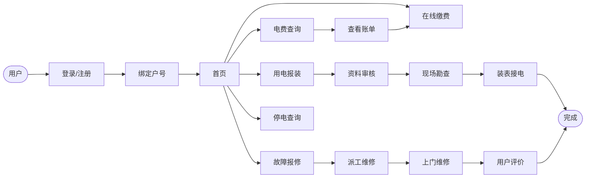
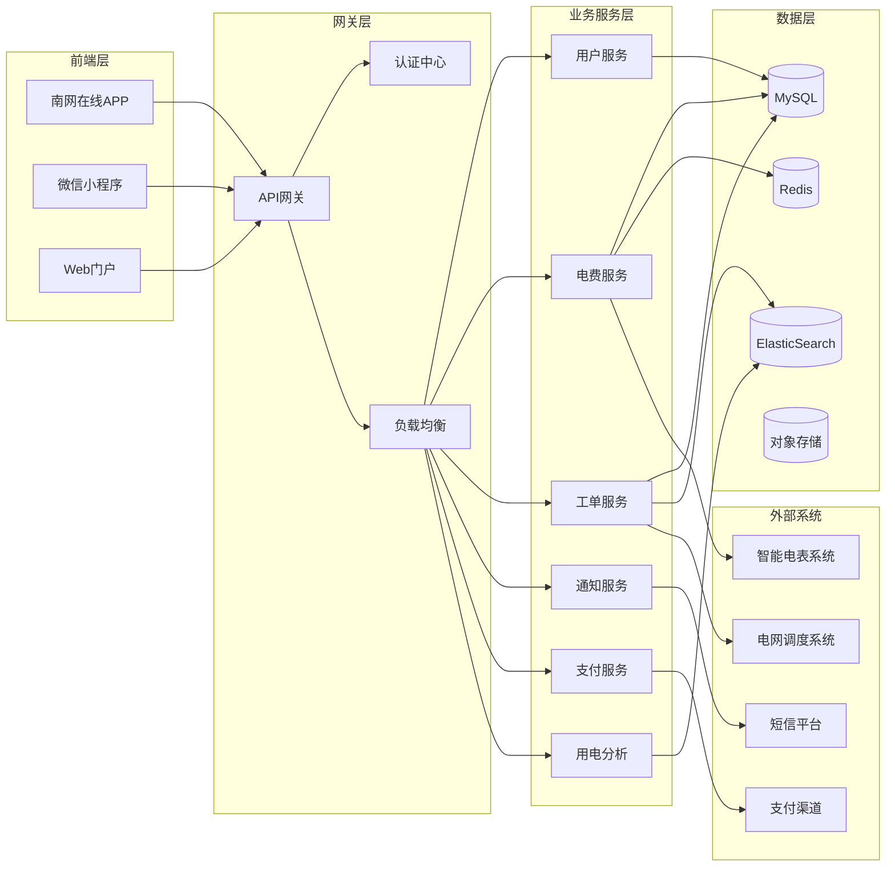
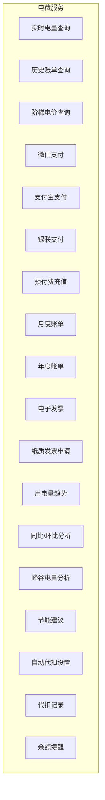
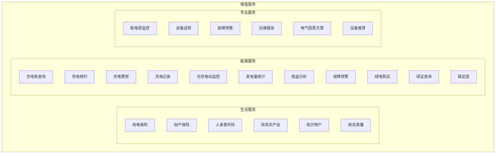
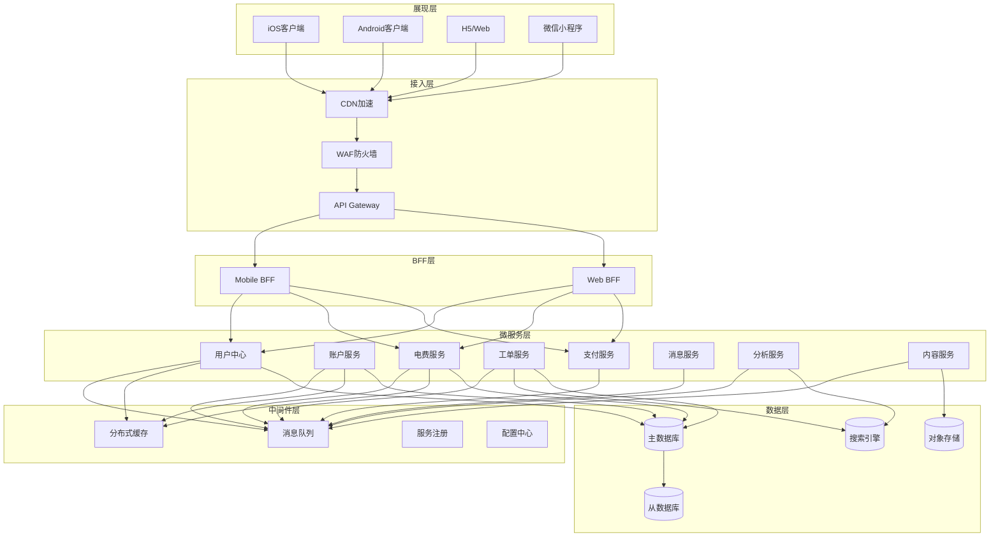

# 功能架构图

## 1. 总体功能架构

```mermaid
graph TB
    APP[南网在线 APP] --> A1[电费服务]
    APP --> A2[用电报装]
    APP --> A3[用电变更]
    APP --> A4[故障报修]
    APP --> A5[停电信息]
    APP --> A6[增值服务]
    APP --> A7[个人中心]
    APP --> A8[用电资讯]
    APP --> A9[智能服务]

    A1 --> B1[电费查询]
    A1 --> B2[在线缴费]
    A1 --> B3[预付电费]
    A1 --> B4[电费账单]
    A1 --> B5[电子发票]
    A1 --> B6[电费代扣]
    A1 --> B7[缴费记录]
    A1 --> B8[用电日历]
    A1 --> B9[用电分析]

    A2 --> C1[低压报装]
    A2 --> C2[高压报装]
    A2 --> C3[直驳用电]
    A2 --> C4[批量报装]
    A2 --> C5[统建报装]
    A2 --> C6[充电桩报装]

    A3 --> D1[更名过户]
    A3 --> D2[更改用电性质]
    A3 --> D3[销户申请]
    A3 --> D4[容量变更]
    A3 --> D5[用电类别变更]

    A4 --> E1[一键报修]
    A4 --> E2[报修进度]
    A4 --> E3[维修评价]
    A4 --> E4[常见问题]

    A5 --> F1[计划停电]
    A5 --> F2[故障停电]
    A5 --> F3[抢修进度]
    A5 --> F4[复电通知]

    A6 --> G1[保险超市]
    A6 --> G2[扶贫商城]
    A6 --> G3[电动汽车]
    A6 --> G4[电气厨房]
    A6 --> G5[配电运维]
    A6 --> G6[光伏管家]
    A6 --> G7[绿电e购]

    A7 --> H1[户号管理]
    A7 --> H2[实名认证]
    A7 --> H3[消息通知]
    A7 --> H4[意见反馈]
    A7 --> H5[设置]
    A7 --> H6[关于我们]

    A8 --> I1[电价信息]
    A8 --> I2[营业网点]
    A8 --> I3[政策文件]
    A8 --> I4[用电小视频]

    A9 --> J1[刷脸办电]
    A9 --> J2[零证办电]
    A9 --> J3[电子签章]
    A9 --> J4[智能客服]
```

## 2. 用户业务流程

```mermaid
flowchart LR
    Start([用户]) --> Login[登录/注册]
    Login --> Bind[绑定户号]
    Bind --> Home[首页]
    
    Home --> Query[电费查询]
    Home --> Pay[在线缴费]
    Home --> Apply[用电报装]
    Home --> Repair[故障报修]
    Home --> Outage[停电查询]
    
    Query --> Bill[查看账单]
    Bill --> Pay
    
    Apply --> Review[资料审核]
    Review --> Survey[现场勘查]
    Survey --> Connect[装表接电]
    Connect --> Done([完成])
    
    Repair --> Dispatch[派工维修]
    Dispatch --> OnSite[上门维修]
    OnSite --> Feedback[用户评价]
    Feedback --> Done
```

## 3. 系统数据流架构

```mermaid
graph LR
    subgraph Frontend[前端层]
        APP_F[南网在线APP]
        Mini[微信小程序]
        Web[Web门户]
    end
    
    subgraph Gateway[网关层]
        APIGW[API网关]
        Auth[认证中心]
        LB[负载均衡]
    end
    
    subgraph Service[业务服务层]
        UserSvc[用户服务]
        BillSvc[电费服务]
        OrderSvc[工单服务]
        NotifySvc[通知服务]
        PaySvc[支付服务]
        Analytics[用电分析]
    end
    
    subgraph Data[数据层]
        MySQL[(MySQL)]
        Redis[(Redis)]
        ES[(ElasticSearch)]
        OSS[(对象存储)]
    end
    
    subgraph External[外部系统]
        GridSys[电网调度系统]
        MeterSys[智能电表系统]
        PayChannel[支付渠道]
        SMS[短信平台]
    end
    
    APP_F --> APIGW
    Mini --> APIGW
    Web --> APIGW
    APIGW --> Auth
    APIGW --> LB
    LB --> UserSvc
    LB --> BillSvc
    LB --> OrderSvc
    LB --> NotifySvc
    LB --> PaySvc
    LB --> Analytics
    
    UserSvc --> MySQL
    BillSvc --> MySQL
    BillSvc --> Redis
    OrderSvc --> MySQL
    OrderSvc --> ES
    Analytics --> ES
    
    BillSvc --> MeterSys
    OrderSvc --> GridSys
    PaySvc --> PayChannel
    NotifySvc --> SMS
```

## 4. 电费服务模块详情

```mermaid
graph TD
    subgraph 电费服务
        Q1[实时电量查询]
        Q2[历史账单查询]
        Q3[阶梯电价查询]
        
        P1[微信支付]
        P2[支付宝支付]
        P3[银联支付]
        P4[预付费充值]
        
        R1[月度账单]
        R2[年度账单]
        R3[电子发票]
        R4[纸质发票申请]
        
        A1[用电量趋势]
        A2[同比/环比分析]
        A3[峰谷电量分析]
        A4[节能建议]
        
        D1[自动代扣设置]
        D2[代扣记录]
        D3[余额提醒]
    end
```

## 5. 增值服务模块详情

```mermaid
graph TD
    subgraph 增值服务
        subgraph 生活服务
            INS1[用电保险]
            INS2[财产保险]
            INS3[人身意外险]
            
            SHOP1[扶贫农产品]
            SHOP2[地方特产]
            SHOP3[助农直播]
        end
        
        subgraph 能源服务
            EV1[充电桩查询]
            EV2[充电预约]
            EV3[充电费用]
            EV4[充电记录]
            
            PV1[光伏电站监控]
            PV2[发电量统计]
            PV3[收益分析]
            PV4[故障预警]
            
            GREEN1[绿电购买]
            GREEN2[绿证查询]
            GREEN3[碳足迹]
        end
        
        subgraph 专业服务
            O&M1[配电房监控]
            O&M2[设备巡检]
            O&M3[故障预警]
            O&M4[运维报告]
            
            KITCHEN1[电气厨房方案]
            KITCHEN2[设备推荐]
        end
    end
```

## 6. 技术架构分层图

```mermaid
graph TB
    subgraph 展现层
        direction LR
        iOS[iOS客户端]
        Android[Android客户端]
        H5[H5/Web]
        MiniP[微信小程序]
    end
    
    subgraph 接入层
        CDN[CDN加速]
        WAF[WAF防火墙]
        API_G[API Gateway]
    end
    
    subgraph BFF层
        BFF_M[Mobile BFF]
        BFF_W[Web BFF]
    end
    
    subgraph 微服务层
        direction LR
        S1[用户中心]
        S2[账户服务]
        S3[电费服务]
        S4[工单服务]
        S5[支付服务]
        S6[消息服务]
        S7[分析服务]
        S8[内容服务]
    end
    
    subgraph 中间件层
        MQ[消息队列]
        CACHE[分布式缓存]
        REG[服务注册]
        CONF[配置中心]
    end
    
    subgraph 数据层
        DB_M[(主数据库)]
        DB_S[(从数据库)]
        ES_C[(搜索引擎)]
        OSS_C[(对象存储)]
    end
    
    iOS --> CDN
    Android --> CDN
    H5 --> CDN
    MiniP --> CDN
    CDN --> WAF
    WAF --> API_G
    API_G --> BFF_M
    API_G --> BFF_W
    BFF_M --> S1 & S3 & S5
    BFF_W --> S1 & S3 & S5
    S1 & S2 & S3 & S4 & S5 & S6 & S7 & S8 --> MQ
    S1 & S2 & S3 --> CACHE
    S4 --> ES_C
    S7 --> ES_C
    S1 & S2 & S3 & S4 --> DB_M
    DB_M --> DB_S
    S8 --> OSS_C
```
